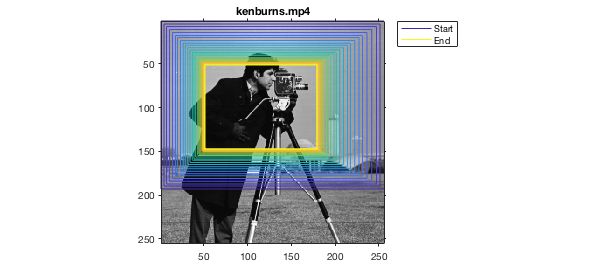
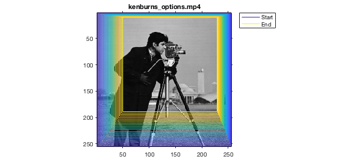
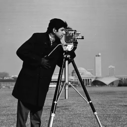
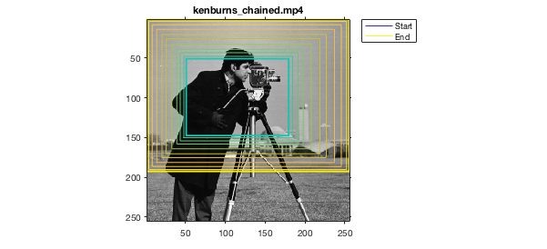
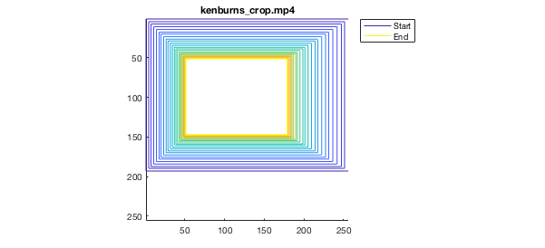

# Ken Burns effect for Matlab
Create a video from an image with a Ken Burns effect.

## Minimal working example
```matlab
Image = imread('cameraman.tif');
videoWriter = VideoWriter('kenburns','MPEG-4');
KenBurns = KenburnsObj(videoWriter, Image);

% Demo
clf;
KenBurns.image();
KenBurns.plot();

% write
KenBurns.make();
```
    



## Demonstration of options
```matlab
Image = imread('cameraman.tif');
videoWriter = VideoWriter('kenburns_options','MPEG-4');
videoWriter.FrameRate = 25;
KenBurns = KenburnsObj(videoWriter, Image);
KenBurns.frameSize = [256 256]; % [height width]
KenBurns.duration = 2; % [s]
KenBurns.startRect = [1 1 1]; % x, y, scale
KenBurns.endRect = [50 10 .7]; % x, y, scale
KenBurns.translation = KenBurns.translationLin;

% demo
clf;
KenBurns.image();
KenBurns.plot();

% write
KenBurns.make();
```
    




## Chaining of transition effects
```matlab
Image = imread('cameraman.tif');
videoWriter = VideoWriter('kenburns_chained','MPEG-4');
KenBurns = KenburnsObj(videoWriter, Image);
KenBurns.translation = @(t) KenBurns.translationCos(KenBurns.translationBackForth(t));

% demo
clf;
KenBurns.image();
KenBurns.plot();

% write
KenBurns.make();
```
    



## For small images
For small images it can be advantageous to upsample the image before creating the KenBurnsObj. This prevents aliasing in the movie.

```matlab
Image = imread('cameraman.tif');
Image = imresize(Image, 2);
videoWriter = VideoWriter('kenburns_upsampled','MPEG-4');
KenBurns = KenburnsObj(videoWriter, Image);

KenBurns.make();
```


## For very large images
For very large images the default 'translation' method is computationally expensive this can be reduced at the expense of some 'shaking' at high zoom levels by setting KenBurns.method = 'crop';

```matlab
Image = imread('cameraman.tif');
videoWriter = VideoWriter('kenburns_crop','MPEG-4');
KenBurns = KenburnsObj(videoWriter, Image);
KenBurns.method = 'crop';

% demo
% don't show the Image, just the crops
clf;
KenBurns.plot();

% write
KenBurns.make();
```
    



